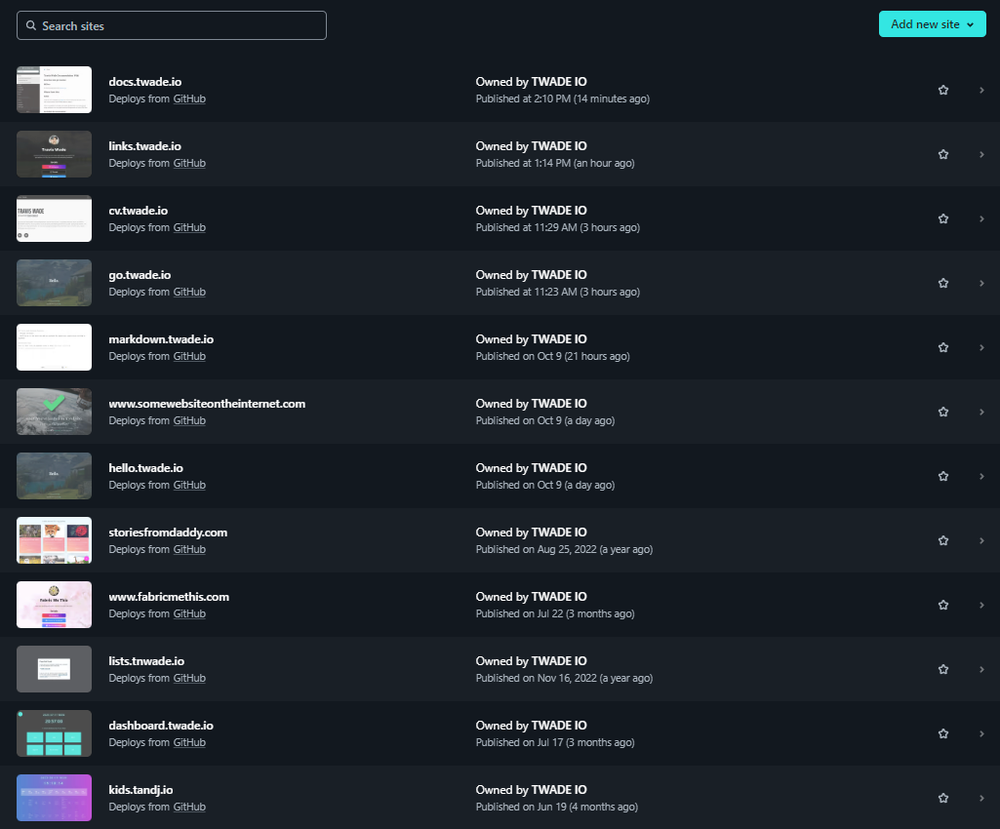
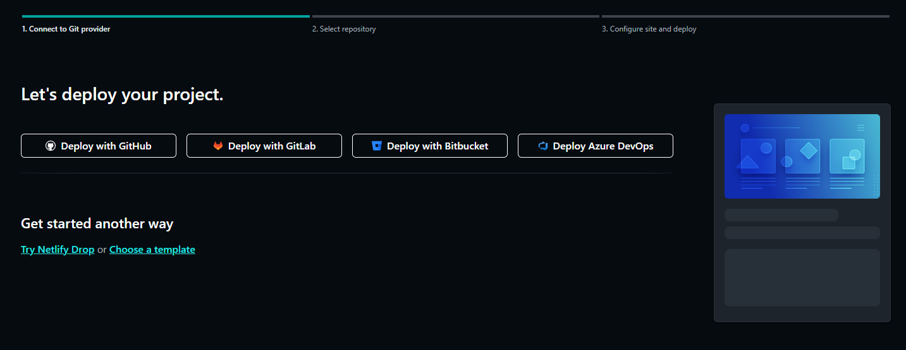

# About Netlify

Netlify is a kickass development tool.

Essentially, it can take your existing repositories (I use Github for my personal projects), and can deploy, run builds and more.
Which is all then served from their global CDN which is fast as hell!
And all I have to do is commit and push my code to the repo.  Netlify then deploys it.

## My Netlify Projects
Here are a few of my projects that are hosted on Netlify:

1. This site!  [MKDocs](https://docs.twade.io)
2. My Links page (which is an open-source Linktree alternative): [links.twade.io](https://links.twade.io)
3. My CV site: [cv.twade.io](https://cv.twade.io)
4. My custom URL shortener site which is basically just a really easy redirect tool: [go.twade.io](https://go.twade.io)
5. Online Markdown Editor: [markdown.twade.io](https://markdown.twade.io)
6. Some website on the internet. Yeah, it's dumb. But it's also one of my very first Netlify projects: [somewebsiteontheinternet.com](https://www.somewebsiteontheinternet.com)
7. A very simple site that only says hello.  Again, another dumb little project I wanted to build out: [hello.twade.io](https://hello.twade.io)
8. An online book that I made for my children with some stories and other fun little things: [storiesfromdaddy.com](https://storiesfromdaddy.com/)
9. Fabric me this.  My wife's link page (using the same open source one I mentioned in bullet 2 above) with a fully functional contact form: [fabricmethis.com](https://www.fabricmethis.com/)
10. A super simple kids schedule. Not the most perfect, but looks nice on a TV in a common room that the children can reference for their daily schedule: [kids.tandj.io](https://kids.tandj.io/)

## Getting started on Netlify

### Supported Git Providers

