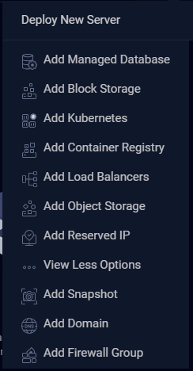
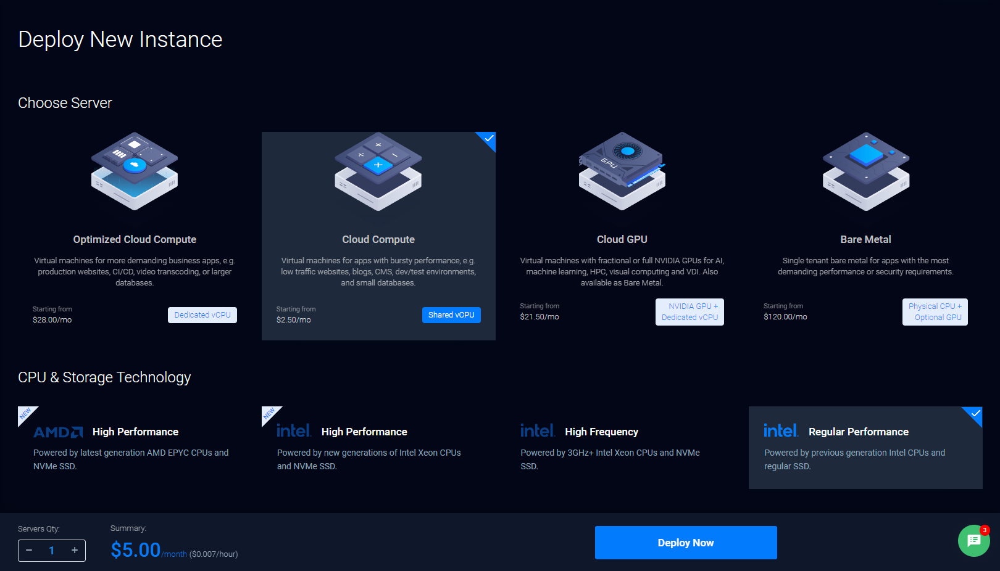
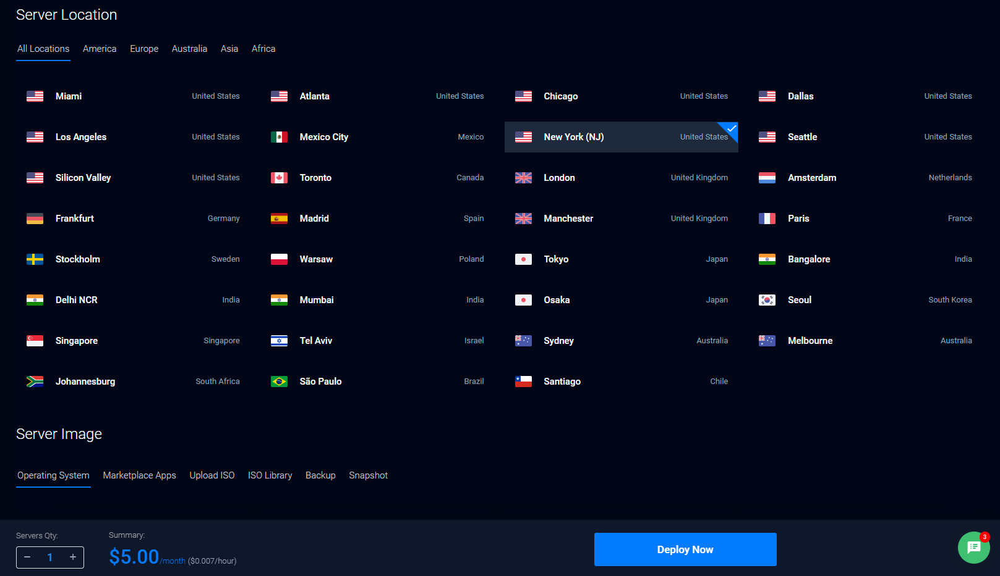
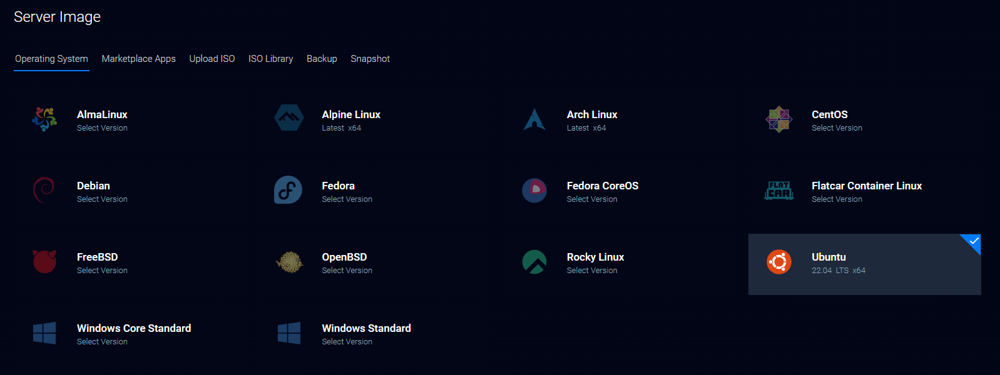
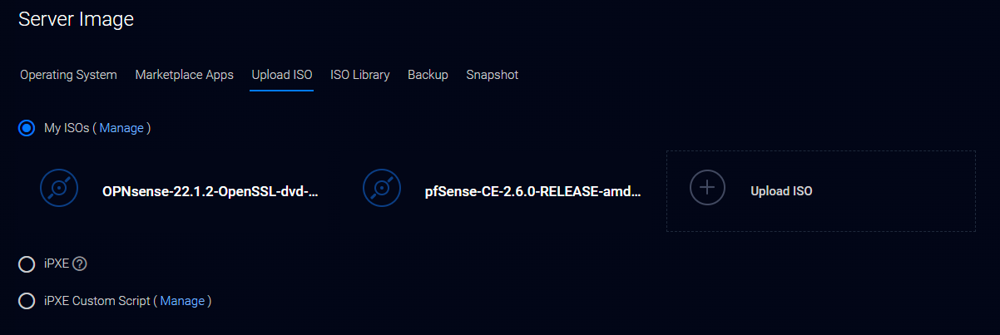
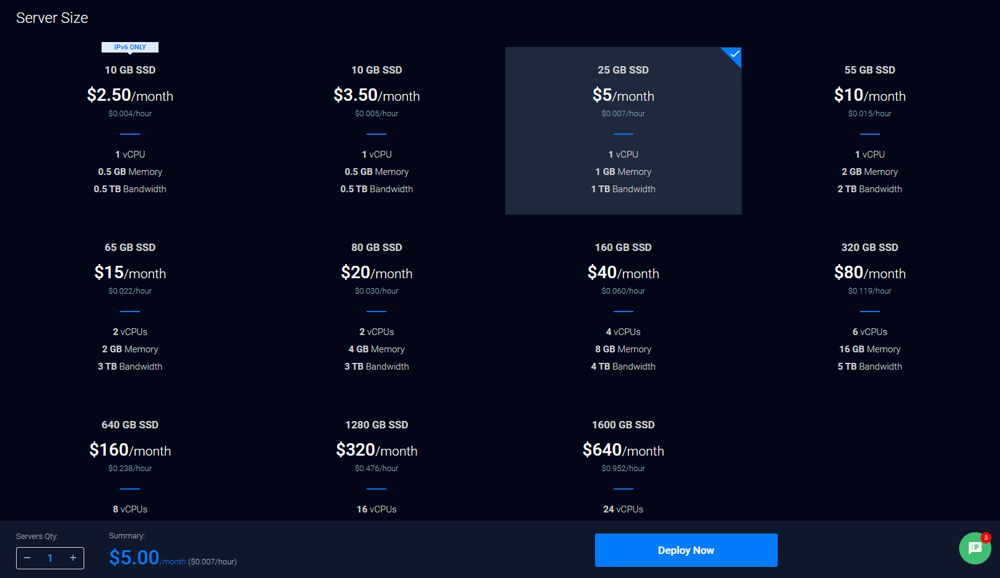
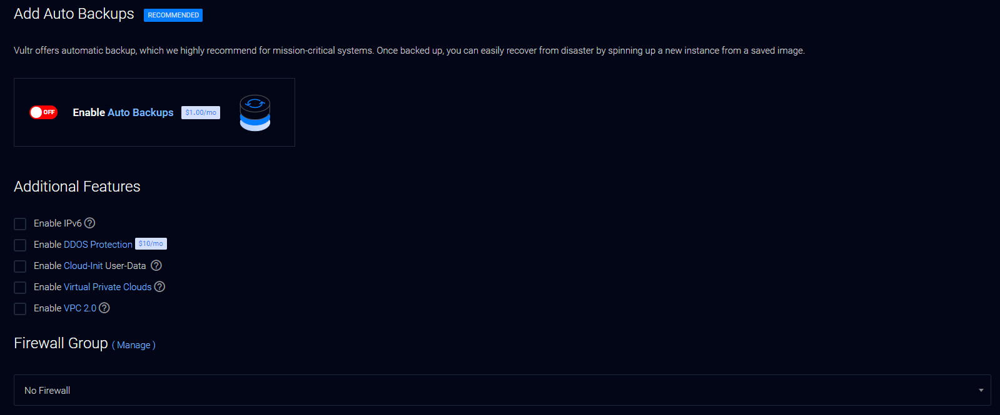

# Vultr

## What is Vultr?

[Vultr](https://www.vultr.com/company/about-us/) is a super simple [VPS](https://aws.amazon.com/what-is/vps/) hosting provider. 

Hosting applications that require a bit more compute capability than that of my other favorite, [Netlify](/netlify/), I typically go with Vultr.

Chose your OS, choose your stack, and click deploy.  You then have your very own server! There are so many options to chose from to fit your
needs and your budget. Add additional block storage, object storage, firewall rules to protect your VPS, custom networks (VPC's) and more.

If you need the capability of a little more rigerous hosting provider without the bloat and complexity, Vultr is for sure the way to go in my opinion.
I've been using them for years, and am always satisfied.

## What to Deploy?

Here's a little screenshot of the "new deploy" menu:

Here's a screenshot showing the affordability and customization options you have:

You can even upload your own OS (`.iso`) or deploy from a backup or snapshot:

## Reference Docs

There are quite a lot of reference documentation that Vultr hosts itself to assist you with most things that you could want to deploy.

For the applications that you want to host, and Vultr doesn't have a doc on it, the good thing is that it's still a server, and you can
reference other documentation for how to build and configure your application according to the OS you choose.  Pretty slick.

* [Operating Systems](https://www.vultr.com/docs/category/arch/)
* [One-Click Apps](https://www.vultr.com/docs/category/apps/)
* [DevOps](https://www.vultr.com/docs/category/devops/)
* [Vultr Reference Guides](https://www.vultr.com/docs/category/best-practices/)
* [Game Servers](https://www.vultr.com/docs/category/game-servers/)
* [Server Apps](https://www.vultr.com/docs/category/blogging/)
* [Infrastructure](https://www.vultr.com/docs/category/containers/)
* [Databases](https://www.vultr.com/docs/category/databases/)

